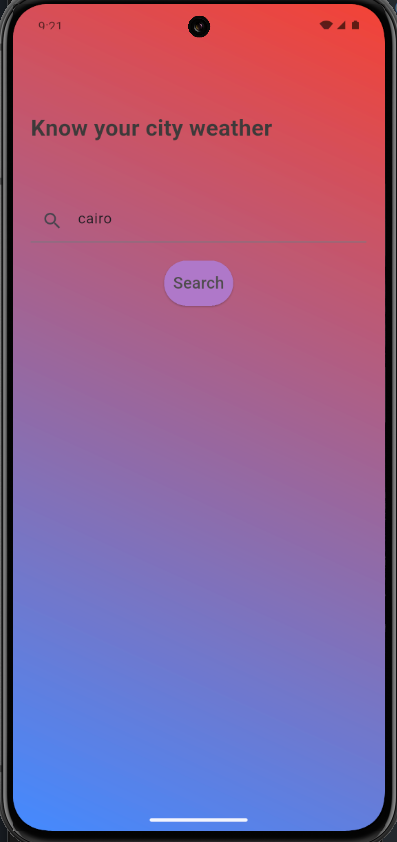
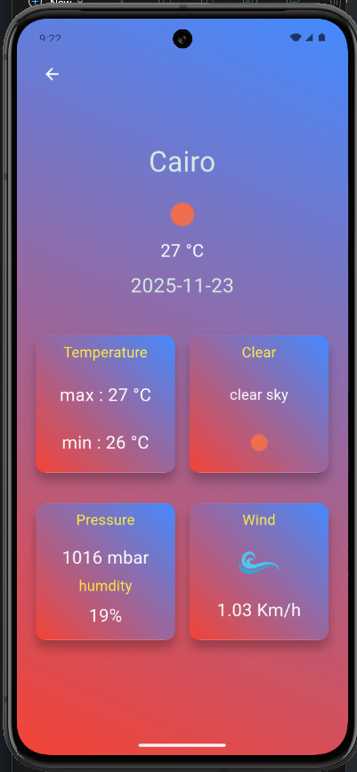
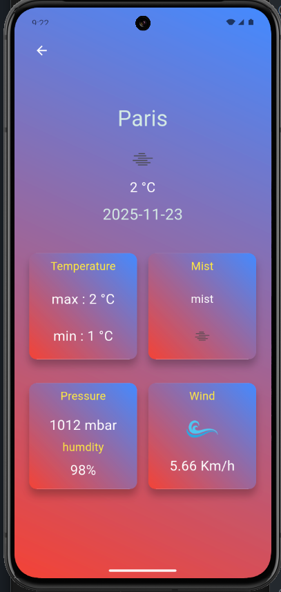
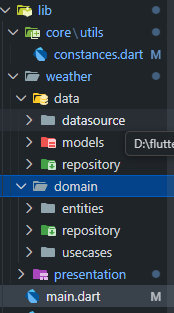

# 📱 Weather App  
A simple, clean, and fast Flutter application for checking real-time weather conditions for any city — built using **Clean Architecture**, **Cubit (Bloc)**, and **Dio** , **OpenWeatherMap API**.

---

## 📸 Screenshots

### 🔍 Search Screen  
| Search Weather |
|---------------|
|  |

### 🌤 Weather Details Screen  
| Weather Details |
|-----------------|
|  |
|  |


---

## 🚀 Overview  
The **Weather App** allows users to search for any city and instantly get detailed weather information like temperature, wind, pressure, humidity, and sky description — all displayed in a modern UI with a smooth gradient design.

The project is built using **Clean Architecture** for better scalability and maintainability.  
It uses **Cubit** for state management and **Dio** for handling HTTP requests.

---

## ✨ Features
- 🔍 Search for any city  
- 🌡 Real-time temperature, min/max  
- 🌥 Weather description (clear, clouds, rain, etc.)  
- 💨 Wind speed  
- 💧 Humidity percentage  
- 🌡 Atmospheric pressure  
- 🎨 Beautiful gradient UI  
- 🧱 Clean Architecture structuring  
- ⚡ Cubit (Bloc) state management  
- 🌐 API integration using Dio  

---

## 🛠 Tech Stack
- **Flutter**
- **Cubit (Bloc)** — State management  
- **Dio** — HTTP client  
- **Clean Architecture** — Scalable project structure  
- **OpenWeatherMap API** — Weather data provider

---

## 📁 Project Structure
|  |

```text
lib/
 ├── core/
 │    └── utils/
 │         └── constances.dart
 │
 ├── weather/
 │    ├── data/
 │    │    ├── datasource/
 │    │    ├── models/
 │    │    └── repository/
 │    │
 │    ├── domain/
 │    │    ├── entities/
 │    │    ├── repository/
 │    │    └── usecases/
 │    │
 │    └── presentation/
 │         ├── cubit/
 │         └── screens/
 │
 └── main.dart
